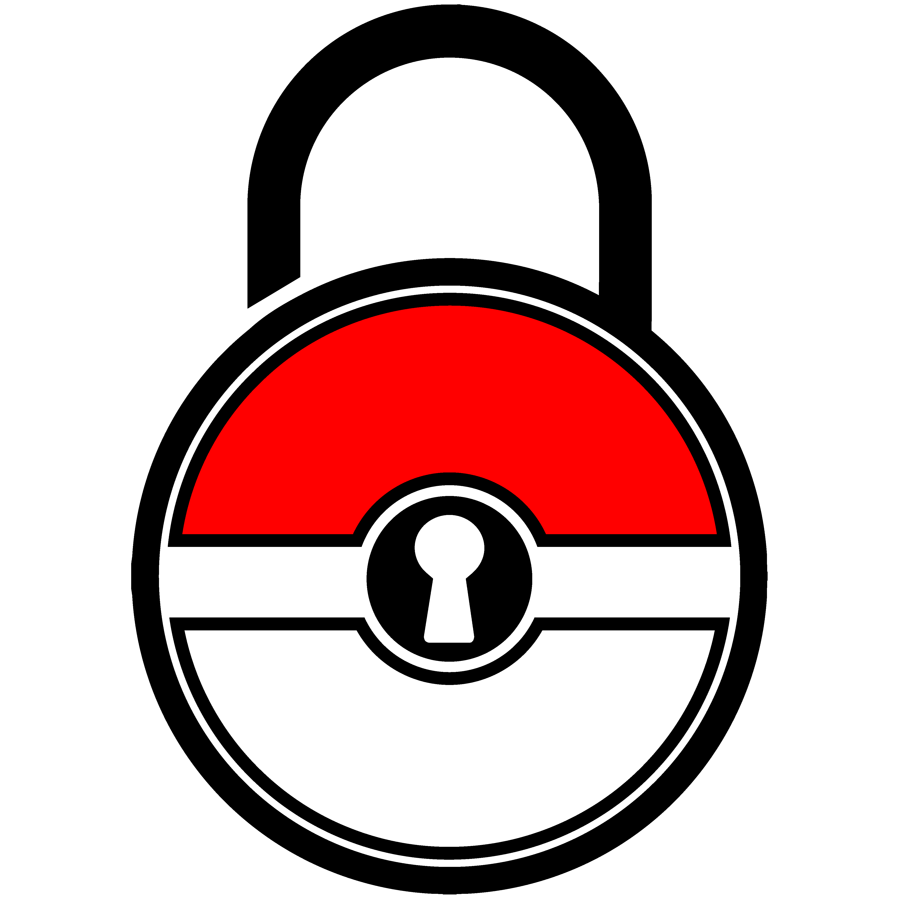

<p align="center">
  
</p>

<h1 align="center">Nuzlocke Overlay</h1>

<p align="center">
  <b>Overlay para OBS con seguimiento en tiempo real de tu equipo Pokemon en runs Nuzlocke</b>
</p>

<p align="center">
  <i>Pokemon Nuzlocke overlay for OBS | Real-time team tracker | Gen 1-9 support | PKHeX integration | Sprite styles | Multi-language</i>
</p>

<p align="center">
  
  
  
  
  
</p>

---

## Que es Nuzlocke Overlay?

Nuzlocke Overlay es una aplicacion de escritorio para Windows que funciona como **overlay para OBS** con **seguimiento en tiempo real** del equipo de Pokemon en runs Nuzlocke. Detecta automaticamente tu save file y muestra los sprites de tu equipo en un **Browser Source de OBS**.

Ideal para **streamers de Twitch y YouTube** que hacen runs Nuzlocke y quieren mostrar su equipo en pantalla. Compatible con **todos los emuladores** (mGBA, DeSmuME, Citra, Yuzu, etc.) y todas las generaciones de Pokemon.

**Soporte completo: Gen 1 a Gen 9** mediante PKHeX (la libreria estandar de Pokemon) con parser nativo como fallback.

---

## Instalacion rapida

### Opcion 1: Instalador NSIS (Recomendado)

1. Descarga `NuzlockeOverlay-Setup-1.0.2.exe` desde [Releases](https://github.com/pokejgameryt-ship-it/nuzlocke-overlay/releases)
2. Ejecutalo y sigue el asistente de instalacion
3. Se instala en `C:\Program Files\Nuzlocke Overlay\`
4. Incluye desinstalador integrado

### Opcion 2: Updater automatico (sin instalador)

1. Descarga `Updater-Windows.bat` desde [Releases](https://github.com/pokejgameryt-ship-it/nuzlocke-overlay/releases)
2. Ejecutalo — descarga el exe y los Sprites automaticamente desde Google Drive
3. Ejecuta `NuzlockeOverlay.exe` desde la carpeta de descarga

### Opcion 3: Instalacion manual

**Paso 1 - Descargar el exe:**
Descarga `NuzlockeOverlay.exe` desde [Releases](https://github.com/pokejgameryt-ship-it/nuzlocke-overlay/releases)

**Paso 2 - Descargar los sprites (~2.2 GB):**
Los sprites estan en Google Drive porque no caben en GitHub. Puedes:
- **Descarga automatica**: Al iniciar la app por primera vez, pregunta si quieres descargarlos
- **Desde Configuracion**: boton "Descargar Sprites" en la seccion Recursos
- **Manualmente**: Abre https://drive.google.com/drive/folders/1itRjBo1HfZI_dUCa5PptR3x-OiEXppQI?usp=drive_link, descarga la carpeta `Recursos` y colocala junto al exe

La estructura debe ser:
```
C:\Users\TU_USUARIO\AppData\Roaming\nuzlocke-overlay\
├── NuzlockeOverlay.exe
└── Recursos\
    └── Sprites\
        ├── Gen1\
        ├── Gen2\
        ├── ...
        └── Gen9\
```

**Paso 3 - Instalar .NET 8.0 Runtime:**
Si no lo tienes, descargalo desde: https://dotnet.microsoft.com/download/dotnet/8.0
(El instalador NSIS lo instala automaticamente si falta)

**Paso 4 - Ejecutar:**
Doble clic en `NuzlockeOverlay.exe`

### Requisitos

- **Windows 10/11** (x64)
- **.NET 8.0 Runtime** (necesario para PKHeX)
- **OBS Studio** (para el overlay)

---

## Juegos compatibles (Gen 1 - Gen 9)

| Generacion | Juegos | Plataforma | Emuladores |
|------------|--------|------------|------------|
| **Gen 1** | Rojo, Azul, Amarillo | Game Boy | VisualBoyAdvance, BGB, ... |
| **Gen 2** | Oro, Plata, Cristal | Game Boy Color | VisualBoyAdvance, SameBoy, ... |
| **Gen 3** | Rubi, Zafiro, Esmeralda, Rojo Fuego, Verde Hoja | GBA | mGBA, VisualBoyAdvance-M |
| **Gen 4** | Diamante, Perla, Platino, HeartGold, SoulSilver | NDS | DeSmuME, melonDS, ... |
| **Gen 5** | Blanco, Negro, Blanco 2, Negro 2 | NDS | DeSmuME, melonDS, ... |
| **Gen 6** | X, Y, Rubi Omega, Zafiro Alfa | 3DS | Citra |
| **Gen 7** | Sol, Luna, Ultra Sol, Ultra Luna | 3DS | Citra |
| **Gen 8** | Espada, Escudo, Brilliant Diamond, Shining Pearl, Legends Arceus | Switch | Yuzu, Ryujinx, Sudachi, Suyu, ... |
| **Gen 9** | Escarlata, Purpura, Legends Z-A | Switch | Yuzu, Ryujinx, Sudachi, Suyu, ... |

> La deteccion del juego es automatica. Si falla, selecciona el juego manualmente en el selector.

---

## Caracteristicas principales

- **Deteccion automatica de save files** - Selecciona el archivo o carpeta del emulador y la app detecta el juego y equipo solamente
- **PKHeX integration** - Usa la libreria PKHeX (.NET 8.0) para leer saves de Gen 1-9 con maxima compatibilidad
- **Parser nativo fallback** - Si PKHeX no esta disponible, un parser interno maneja Gen 1-5
- **Sprites en tiempo real** - Se actualiza automaticamente cuando guardas en el juego
- **43+ estilos de sprites** - Gen 1-9, animados (GIF) y estaticos (PNG), incluyendo Artworks, Home, Mystery Dungeon, etc.
- **Layout editor** - Arrastra y redimensiona los slots en un canvas 1920x1080
- **Nickname personalizado** - Fuente, color, degradado, contorno, tamano auto
- **Placeholder** - Rellena slots vacios con un sprite por defecto
- **Presets globales** - Guarda y carga layouts para reutilizar
- **Multiple proyectos** - Crea tantos proyectos como necesites
- **Modo segundo plano** - La app se queda en la bandeja del sistema al cerrar
- **6 idiomas** - Espanol, Ingles, Frances, Aleman, Japones, Ruso
- **Tour interactivo** - Guia paso a paso con spotlight para aprender a usar la app
- **Busqueda de proyectos** - Filtra y ordena proyectos en la barra lateral
- **Buscador de fuentes** - Selecciona entre las fuentes del sistema con preview visual y busqueda en tiempo real
- **Social links** - Acceso rapido a Twitch, YouTube, TikTok y Discord desde ajustes
- **Descarga automatica de Sprites** - Descarga los sprites desde Google Drive con un clic en Configuracion
- **Sistema de actualizaciones** - Comprobacion automatica de nuevas versiones al iniciar, popup de changelog
- **Instalador NSIS** - Instalador grafico con asistente, incluye desinstalador

---

## Configuracion en OBS

1. Abre Nuzlocke Overlay y selecciona o crea un proyecto
2. Haz clic en "Examinar" y selecciona tu save file o la carpeta del emulador
   - Si seleccionas una carpeta, se abrira un segundo dialogo para elegir el archivo save especifico
3. La app detecta automaticamente el juego y genera el URL del overlay
4. Copia la URL y en OBS Studio:
   - Click derecho en Fuentes -> **Agregar** -> **Navegador**
   - Pegar la URL copiada
   - Ancho: **1920**, Alto: **1080**
   - Marca **Controlar el URL via JavaScript**
5. Ajusta los slots en el editor de layout de la app

---

## Emuladores recomendados

| Generacion | Emulador | Formato | Notas |
|------------|----------|---------|-------|
| Gen 1-2 | VisualBoyAdvance / SameBoy | .sav / .sgb | |
| Gen 3 | **mGBA** | .sav | savegamePath vacio en config |
| Gen 4-5 | DeSmuME / melonDS | .dsv | |
| Gen 6-7 | Citra | .citra / main | Selecciona carpeta 00000001 |
| Gen 8-9 | Yuzu / Ryujinx / Sudachi | .nx | |

**Configuracion mGBA:** En Preferences > Saving, deja "Save game path" vacio para guardar en la misma carpeta que la ROM. Asegurate de tener `vbaBugCompat=1` y `gba.forceGbp=1`.

**Citra:** La app puede navegar directamente a la carpeta del save (e.g. `00000001`) y te permite elegir el archivo especifico.

---

## Estructura de carpetas

### Despues de instalar con NSIS
```
C:\Program Files\Nuzlocke Overlay\      # App instalada (solo lectura)
├── NuzlockeOverlay.exe
├── resources\                          # Archivos de la app
│   └── app\                            # Codigo fuente
├──Uninstall Nuzlocke Overlay.exe       # Desinstalador

C:\Users\TU\AppData\Roaming\nuzlocke-overlay\   # Datos del usuario
├── projects.json                       # Proyectos guardados
├── presets.json                        # Presets guardados
├── config.json                         # Configuracion
├── logs\                               # Logs de la app
└── Recursos\                           # Sprites (descargados)
    └── Sprites\
        ├── Gen1/
        ├── Gen2/
        ├── ...
        └── Gen9/
```

### Si usas Updater o portable
```
Carpeta de descarga\
├── NuzlockeOverlay.exe
├── Updater-Windows.bat
├── logo.png
├── main.js
├── preload.js
├── app/
│   ├── index.html
│   ├── app.js
│   ├── app.css
│   └── i18n.js
├── src/
│   ├── save-parser.js
│   ├── pkhex-reader.js
│   ├── swish-crypto.js
│   ├── detect-save.js
│   ├── sprite-scanner.js
│   ├── file-watcher.js
│   ├── project-manager.js
│   ├── preset-manager.js
│   ├── pokemon-data.js
│   └── logger.js
├── PkHexReader/
├── public/
│   ├── overlay.html
│   ├── js/overlay.js
│   ├── css/overlay.css
│   └── recursos-manifest.json
└── Recursos/
    └── Sprites/
        ├── Gen1/
        ├── Gen2/
        ├── ...
        └── Gen9/
```

---

## Estilos de sprites

Los sprites se organizan por generacion en `Recursos/Sprites/`. La app escanea subcarpetas automaticamente.

Para agregar un nuevo estilo:
1. Crea una carpeta en `Recursos/Sprites/GenX/`
2. Pon los archivos PNG o GIF con el numero del Pokemon como nombre (ej: `025.png` para Pikachu)
3. Selecciona el estilo en el selector de la app

**Formatos de nombre soportados:**
- `025.png` / `25.gif` (numerico)
- `025-pikachu.png` (numerico + nombre)
- `25-alola.png` (formas regionales)
- `BT025.png` (Battle Trozei)

---

## Atajos de teclado

| Atajo | Accion |
|-------|--------|
| `Ctrl+Z` | Deshacer |
| `Ctrl+Shift+Z` | Rehacer |
| `Ctrl+A` | Seleccionar todos los slots |
| `Escape` | Deseleccionar |
| `Ctrl+Click` | Seleccion multi |
| `Shift+Click` | Rango de seleccion |

---

## Redes sociales

Sigueme en mis redes para estar al dia del proyecto y mas contenido Pokemon:

| Plataforma | Enlace |
|------------|--------|
| Twitch | [pokejgamer](https://www.twitch.tv/pokejgamer) |
| YouTube | [PokeJgamer](https://www.youtube.com/channel/UCY-yUwAx1C0ApRHWKdo8o0Q) |
| TikTok | [@pokejgamer](https://www.tiktok.com/@pokejgamer) |
| Discord | [Unirse al servidor](https://discord.gg/upbhwavQas) |

---

## Donar

Si te gusta la app y quieres apoyar el proyecto:

[](https://streamelements.com/pokejgamer-de2e0/tip)

---

## Tecnologias

- **Electron 28** - Framework de escritorio
- **PKHeX.Core** - Libreria de lectura de saves Pokemon (via .NET 8.0)
- **Express** - Servidor HTTP para el overlay
- **Chokidar** - File watcher para detectar cambios en saves
- **Node.js** - Runtime
- **i18n** - Sistema de internacionalizacion con 6 idiomas
- **NSIS** - Instalador grafico para Windows

---

## Que hay nuevo en v1.0.2

- **Instalador NSIS** - Instalador grafico con asistente. Se instala en Program Files y incluye desinstalador
- **Seccion Recursos en Configuracion** - Botones "Descargar Sprites" y "Abrir carpeta" para gestionar los sprites desde la app
- **Descarga automatica de Sprites** - Al iniciar por primera vez sin sprites, la app pregunta si quieres descargarlos desde Google Drive
- **Sistema de actualizaciones** - Comprobacion automatica de nuevas versiones al iniciar. Popup de notificacion con opcion de omitir
- **Changelog popup** - Al instalar una version nueva, muestra las notas de la release
- **Buscador de fuentes** - Selector de fuente con busqueda en tiempo real, preview visual y tags de categoria
- **Fix fonts** - Deteccion de fuentes del sistema via PowerShell con script temporal (resuelve problemas en builds empaquetados)
- **Fix Electron menu** - Barra de menu nativa eliminada para apariencia limpia en OBS
- **Fix Google Drive download** - Descarga reescrita con manifiesto JSON (10,018 archivos, 5 workers en paralelo)
- **Fix logger** - Logs escritos en AppData en vez de Program Files (EPERM fix)
- **Fix CSP** - Corregido Content Security Policy para builds empaquetados

---

## Que hay nuevo en v1.0.1

- **Buscador de fuentes del sistema** - Selecciona entre ~539 fuentes con preview visual y busqueda
- **Busqueda y orden de proyectos** - Filtra proyectos por nombre y ordena por fecha o alfabeticamente
- **Fix placeholder en OBS** - Sprite placeholder ahora carga correctamente
- **Fix sprites scanner** - Ya no crashea si falta la carpeta Recursos

---

## Licencia

MIT License - Libre para uso personal y comercial.

---

<p align="center">
  Creado con carino para la comunidad Pokemon Nuzlocke
</p>
